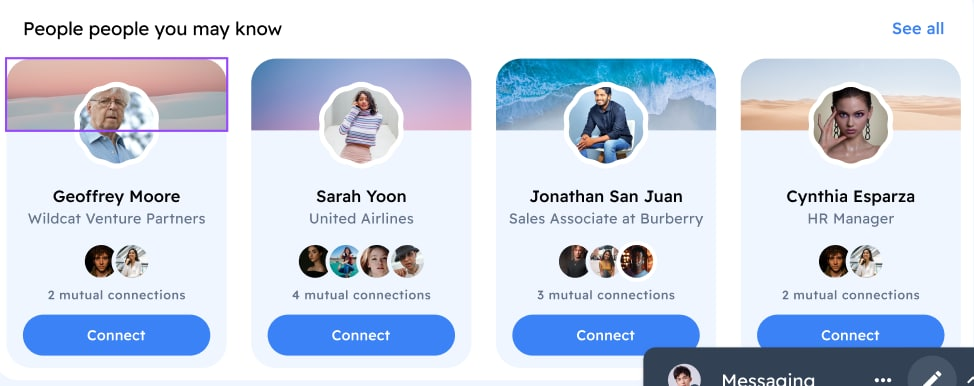

Итааак, домашечка. Будет здорово, если к следующей неделе каждый попробует что-то сообразить. Хотя бы просто поднять сборку webpack. Тогда вы можете задать мне вопросы на домашке.
Что в сборке? `scss`, `ts`,` картиночки`,` шрифтики`,` inline-svg`
Плагины: `CssMinify`, `CssExtract`.  И конечно - `HtmlWebpack`.

Что нужно натворить?
1. Для начала просто поднять сборку с перечисленными плагинами и лоадерами.
2. Карусель.
    - стили по БЭМ
    - динамическое создание элементов карусели с помощью JS
    - кручение карусельки. **По кругу в обе стороны необязательно**. Можно в любую из сторон
    - дизайна нет, но вы держитесь. Можно взять отсюда [нет подписки](https://music.yandex.ru/non-music) или [если есть подписка Яндекс](https://music.yandex.ru/home?utm_source=main_stripe_big). Вот еще для ["без подписки"](https://podcasts.google.com/). Можно сделать самому (пример на картиночке). Должен быть удивительно красивый текст с шрифтами (можете выбрать любые. Если будут проблемы - пишите), обязательно картинка сзади, взятая из `json`-файла (название из папки). ВАЖНО: не нужен backend (json-server), здесь задание не про это. Просто `import data from './data.json'`. И, конечно, красивые inline-svg, которые как-то меняют свой стиль
      

Все о настройке [webpack](https://webpack.js.org/guides/) - прочитав это вы станете почти амбассадором webpack. [Книжка про веб-паттерны](https://www.patterns.dev/posts/classic-design-patterns/), [сайт про веб-паттерны](https://www.patterns.dev/), [история о велосипедах с модулями](https://habr.com/ru/company/yandex/blog/192874/)Папку, в которую будет собирать webpack обязательно добавить в gitignore!

Задание достаточно сложное, если есть вопросы - пишите. Демку в ближайшие пару дней (или после 27) сделаю

[Webpack+React](https://github.com/WelcomeDev/ws-studens-webpack/tree/feature/react-jsx), [Webpack+TS](https://github.com/WelcomeDev/ws-studens-webpack/tree/feature/typescript)
Реакт добавлять не нужно. Но кто оооооочень хочет - может
